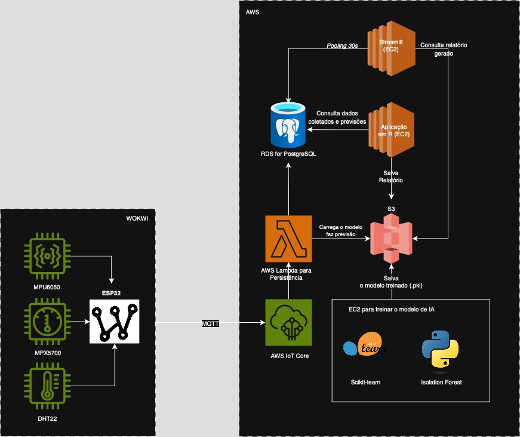

# FIAP - Faculdade de Informática e Administração Paulista

<p align="center">
  <a href="https://www.fiap.com.br/">
    
  </a>
</p>

---

# 📦 Enterprise Challenge - Sprint 1
<!-- Título do projeto: curto, claro, direto. Pode destacar o problema e a tecnologia principal -->

## 👥 Grupo 44
<!-- Nome oficial do grupo, se houver. Pode usar um nome criativo também -->

## 👨‍🎓 Integrantes:
- Amanda Vieira Pires (RM565045)
- Ana Gabriela Soares Santos (RM565235)
- Bianca Nascimento de Santa Cruz Oliveira (RM561390)
- Milena Pereira dos Santos Silva (RM565464)
- Nayana Mehta Miazaki (RM565045) 

## 👩‍🏫 Professores:
### Tutor(a)  
-  Lucas Gomes Moreira
### Coordenador(a)  
- André Godoi

---

## 📜 Descrição do Projeto

### 🧠 Objetivo e Motivação
Este projeto tem como foco a prevenção de falhas em linhas de envase da indústria de bebidas, especificamente no setor de engarrafamento de cervejas e refrigerantes. Este segmento foi escolhido por sua natureza altamente automatizada, com produção contínua e volumes expressivos, em que qualquer interrupção inesperada pode resultar em perdas significativas de insumos, produtividade e qualidade do produto final. 

As principais causas dessas falhas muitas vezes estão associadas a pequenas variações em variáveis operacionais como temperatura, pressão e vibração, que passam despercebidas por sistemas de monitoramento tradicionais. Ao mesmo tempo, esse setor apresenta alta maturidade tecnológica e viabilidade para adoção de soluções digitais de predição e automação. 

Nesse contexto, o projeto propõe o desenvolvimento de uma solução digital de manutenção preditiva, utilizando sensores simulados para monitoramento dessas variáveis críticas. Os dados são enviados via IoT para a nuvem, onde são processados por modelos de aprendizado de máquina que identificam padrões anômalos. A solução inclui visualização interativa por meio de dashboards com alertas preventivos, contribuindo para maior estabilidade operacional e práticas sustentáveis (ESG). 
Toda a arquitetura do projeto é implementada na nuvem (AWS), garantindo escalabilidade, colaboração remota entre os integrantes do grupo e fidelidade a um cenário de aplicação industrial real. 

---

### ⚙️ Simulação com Wokwi – Sensores e ESP32 Virtualizados 
Nesta nova versão do projeto, adotamos a simulação completa do ambiente físico via Wokwi, uma plataforma online que permite programar microcontroladores e sensores em um ambiente virtual de forma realista e interativa. 

#### Estrutura de Simulação: 
- Microcontrolador: ESP32 (simulado), programado em C++ com base na plataforma Arduino.
- Sensores utilizados:
- DHT22: sensor de temperatura e umidade;
- MPX5700: sensor de pressão analógica; 
- MPU6050: acelerômetro e giroscópio para vibração e movimento. 

#### Funcionamento: 

- O ESP32 lê os dados dos sensores simulados com frequência definida (ex: a cada 5 segundos);
- O código embarcado processa e envia os dados via protocolo MQTT diretamente para o serviço AWS IoT Core; 
- A partir do IoT Core, os dados seguem para o pipeline de processamento na nuvem, sendo armazenados em PostgreSQL via AWS RDS;
- Em seguida, os modelos de IA identificam padrões e emitem alertas que são exibidos no dashboard Streamlit. 

#### Vantagens do uso do Wokwi:
- Evita dependência de sensores físicos durante o desenvolvimento inicial;
- Permite controle total dos cenários simulados (falhas, flutuações, ruídos);
- Facilita testes de conectividade com nuvem e entendimento do ciclo completo IoT → ML → Visualização;
- Aproxima o projeto da realidade industrial, com menor custo e alta replicabilidade pedagógica. 

Essa simulação representa fielmente o comportamento operacional da linha de envase, fornecendo dados compatíveis com um ambiente físico real. Também permite uma transição simples para sensores reais, bastando trocar o ambiente de simulação pelo hardware físico e manter o restante da arquitetura intacta. 

---

### 🧠 Justificativa Técnica
<!--
Por que essa indústria?
Por que esse problema?
Por que esse tipo de abordagem técnica (simulação, ML, dashboard)?
Qual impacto esperado? (produtividade, ESG, redução de falhas, etc.)
-->
#### Análise Estatística com R 

- A linguagem R foi incorporada ao projeto por sua excelência em análise estatística e por ser amplamente explorada nas disciplinas do curso;
- É utilizada para análises descritivas e preditivas com base nos dados armazenados no PostgreSQL, por meio de scripts executados no RStudio Server hospedado em uma instância EC2;
- Gera relatórios automatizados em PDF com gráficos e insights, que são salvos no Amazon S3 e disponibilizados para download via dashboard.

Trade-off: Apesar de exigir configuração de ambiente e integração com outros serviços AWS, R proporciona recursos robustos de regressão, séries temporais e visualizações avançadas que enriquecem o diagnóstico e compreensão dos dados. 

#### Banco de Dados: PostgreSQL via AWS RDS
- Banco relacional robusto, com suporte a séries temporais e consultas SQL avançadas;
- Integração fluida com Python (psycopg2, sqlalchemy) e ferramentas de visualização;
- Escalável e confiável para cenários reais, com gerenciamento simplificado na AWS. 

Trade-off: Curva de configuração um pouco maior que SQLite ou Firebase, mas com ganhos de performance, consistência e colaboração em nuvem. A opção por nuvem também evita dependência de máquinas locais, garantindo disponibilidade e acesso remoto por todos do grupo. 

#### Visualização: Streamlit com Ploty

- Streamlit permite transformar scripts Python em apps web interativos com mínimo esforço;
- Plotly será usado para criar gráficos dinâmicos (linhas, dispersão, heatmaps) com interatividade embutida;
- O dashboard mostrará indicadores atuais, gráficos de tendência e alertas em tempo real diretamente conectados ao banco de dados.

Trade-off: Streamlit oferece agilidade, mas menos controle visual do que frameworks como Dash. A escolha por Plotly garante boa qualidade visual no Streamlit, sem exigir dependências externas. Looker, apesar de potente em visualização, não suporta lógica embarcada de IA e simulações dinâmicas, pois depende de dados já processados. Isso inviabiliza o uso em protótipos baseados em IA executada em tempo real. 

Futuramente, Dash poderá ser explorado para criar interfaces mais sofisticadas e com navegação personalizada, caso o projeto evolua para uso em escala. 

#### Inteligência Artificial - Detecção de Anomalias e Padrões

a) Abordagem: Aprendizado Não Supervisionado 
Como os dados simulados não possuem rótulos explícitos (ex: "falha" ou "normal"), adotamos aprendizado não supervisionado para detectar padrões inesperados e agrupar comportamentos operacionais similares. A estratégia é baseada em duas abordagens complementares: 

1. Clusterização com K-Means: Permite identificar diferentes perfis operacionais (ex: regimes normais de operação, resfriamento, aquecimento, ou pré-falha). Essa técnica ajuda a reconhecer grupos de funcionamento consistentes e pode sinalizar quando o sistema opera fora de um desses perfis esperados. 

2. Detecção de Anomalias com Isolation Forest: Após o agrupamento, aplica-se o Isolation Forest para identificar pontos fora do padrão em relação ao comportamento histórico. Um dado pode pertencer a um cluster conhecido, mas ainda assim se comportar de forma isolada — o que é útil para capturar anomalias contextuais. 

A combinação das duas abordagens amplia a capacidade do sistema em detectar desvios tanto estruturais (mudança de grupo) quanto pontuais (outliers). 

b) Modelos Selecionados (Resumo Integrado): 
No contexto do nosso pipeline de manutenção preditiva, optamos por dois modelos principais: 

1. K-Means: Para identificar diferentes estados operacionais do processo de envase, agrupando dados de sensores em clusters. Isso permite detectar padrões consistentes de funcionamento e indicar desvios de comportamento. 

2. Isolation Forest: Para detectar anomalias pontuais nos dados em tempo real. Ele avalia a pontuação de isolamento dos dados dentro de uma janela de tempo, destacando eventos fora do padrão operacional mesmo dentro de um cluster conhecido. 

Esses dois modelos foram escolhidos por serem eficientes, explicáveis e compatíveis com os recursos computacionais disponíveis em nossa infraestrutura. 

Modelos adicionais como DBSCAN e One-Class SVM poderão ser utilizados de forma exploratória para análises futuras e refinamento dos critérios de agrupamento e outlier, especialmente à medida que aumentarmos o volume de dados e a complexidade do ambiente de simulação ou integração com sensores reais. 

c) Framework e Justificativa Técnica: 
- O scikit-learn foi adotado por ser a biblioteca mais adequada para modelagem clássica em Python. Ele oferece suporte direto aos modelos selecionados, integração com pandas e excelente documentação. Seu uso é ideal para projetos acadêmicos e provas de conceito, permitindo rápido prototipagem e visualização. 

Frameworks como Keras e TensorFlow foram descartados nesta etapa por serem voltados a redes neurais profundas, mais adequadas a problemas com grande volume de dados rotulados. Eles também requerem maior infraestrutura de processamento e complexidade desnecessária neste escopo inicial. 

---

### 📊 Análise Preditiva com R (Complementar à IA) 
Embora a detecção de anomalias e o monitoramento online sejam realizados com Python e scikit-learn, o projeto também prevê uma camada complementar de análise preditiva estatística com uso da linguagem R. Essa camada será utilizada para: 

- Analisar tendências e padrões históricos dos dados de sensores;
- Aplicar técnicas de regressão e análise de séries temporais (como ARIMA ou suavização exponencial);
- Gerar insights descritivos e relatórios aprofundados que complementem a lógica de alerta instantâneo. 

Essa abordagem é especialmente relevante para validação cruzada dos modelos, estudos de comportamento cíclico de variáveis (ex: pressão ao longo dos turnos) e construção de relatórios técnicos. A escolha da linguagem R se dá pela sua robustez em análise estatística e por ser amplamente explorada nas aulas do curso. 

Os scripts R serão executados na nuvem, em ambiente EC2 configurado com RStudio Server, extraindo dados diretamente do banco PostgreSQL via pacotes como RPostgreSQL ou DBI, e utilizando bibliotecas como ggplot2, forecast, dplyr e tidyr para processamento e visualização. 

Ao final de cada análise estatística, o RStudio Server gera um relatório em formato PDF com gráficos, insights e recomendações, que é armazenado automaticamente no Amazon S3. Este relatório poderá ser baixado diretamente pelo usuário final através de um botão no dashboard Streamlit, facilitando o acesso a análises periódicas profundas. 

Essa camada não interfere diretamente no pipeline de alertas, mas atua como ferramenta de suporte analítico para validar e interpretar melhor os padrões encontrados pelos modelos de machine learning. A execução em nuvem permite automação, compartilhamento e persistência dos scripts de análise em um ambiente escalável, assim como integração futura com dashboards ou relatórios gerados diretamente a partir do RStudio Server hospedado na AWS. 

---

### 🔄 Pipeline de Execução e Re-Treinamento 
A pipeline completa do projeto foi desenhada para funcionar de forma contínua e escalável, simulando o comportamento de um sistema produtivo real: 

1. Aquisição dos dados:
   - O ESP32, simulado via Wokwi, coleta dados dos sensores e envia via MQTT para o AWS IoT Core. 

2. Ingestão e Armazenamento:
   - O AWS IoT Core envia os dados diretamente para uma função AWS Lambda, que processa os dados e os insere no banco PostgreSQL (via AWS RDS). 

3. Janela de Processamento:
   - Os dados são processados em janelas móveis (ex: últimas 10 minutos), agregando leituras por tempo para análises consistentes. 

4. Inferência com Modelo Treinado:
   - A cada nova janela, o sistema aplica o modelo salvo (.pkl) com scikit-learn, acessado a partir do Amazon S3, para calcular: 
     - O cluster de operação atual (via K-Means); 
     - A pontuação de anomalia (via Isolation Forest). 
   - Se detectada anomalia, um alerta é disparado e salvo no banco. 

5. Visualização no Dashboard:
   - O Streamlit acessa diretamente o PostgreSQL e o modelo .pkl para: 
     - Apresentar os dados atuais dos sensores; 
     - Mostrar as previsões do modelo em tempo real; 
     - Exibir alertas e gráficos interativos com Plotly. 
   - A página é atualizada automaticamente em intervalos regulares (ex: a cada 30 segundos), usando st_autorefresh, o que permite simular um comportamento quase em tempo real com base nas atualizações no banco de dados. 

⚠️ Para contextos com alta carga de leitura ou múltiplos usuários simultâneos, essa abordagem pode se tornar limitada. Como evolução futura, recomendamos migrar para um modelo com cache, streaming de dados ou dashboards reativos mais robustos (ex: Dash + Redis, Kafka ou WebSockets). 

6. Treinamento e Re-treinamento do modelo: 

   - O primeiro modelo é treinado após o banco PostgreSQL conter volume suficiente de dados coletados via sensores simulados. Um script Python é executado manualmente ou por agendamento em uma instância EC2, com ambiente pré-configurado com scikit-learn, pandas e bibliotecas auxiliares. Este script:
     - Consulta os dados históricos no PostgreSQL (ex: primeira semana de operação);
     - Treina o modelo inicial (K-Means + Isolation Forest);
     - Salva o arquivo .pkl gerado no Amazon S3, onde ficará disponível para inferência pelo dashboard. 

   - Periodicamente (ex: 1x por semana), esse mesmo script pode ser executado novamente na EC2 para:
     - Coletar novos dados acumulados; 
     - Re-treinar os modelos com base nos dados atualizados; 
     - Substituir o arquivo .pkl no S3. 

Essa abordagem garante que o sistema continue aprendendo com os dados simulados ou reais, mantenha o modelo atualizado automaticamente e ofereça um ciclo completo de coleta, análise e visualização inteligente com base em dados industriais. 

---

### 🔔 Alertas e Dashboards 

O escopo do app Streamlit contempla a visualização contínua dos dados operacionais e exibição de alertas gerados pela IA de forma acessível e em tempo quase real. 

O modelo de IA é executado em ambiente separado e registra os alertas diretamente no banco de dados (PostgreSQL). A aplicação Streamlit consome essas informações e exibe em tempo real via dashboards: 

- Lista de alertas classificados por severidade;
- Destaques visuais no dashboard com base no timestamp e variável associada;
- Contextualização da anomalia com dados históricos da variável envolvida. 

O Streamlit não realiza a inferência diretamente, mas se conecta ao banco para exibir os alertas previamente identificados pelo modelo de IA em execução contínua no backend. 

---

### 🧪 Bibliotecas Python Utilizadas

| Biblioteca     | Função                                                                 |
|----------------|------------------------------------------------------------------------|
| `pandas`       | Manipulação de dados tabulares e séries temporais                     |
| `numpy`        | Operações matemáticas e geração de distribuições de dados             |
| `scikit-learn` | Modelagem de machine learning (K-Means, Isolation Forest, etc.)       |
| `matplotlib`   | Geração de gráficos estáticos para análises e relatórios              |
| `seaborn`      | Visualizações estatísticas complementares para EDA                    |
| `plotly`       | Gráficos interativos utilizados dentro do dashboard Streamlit         |
| `streamlit`    | Criação da interface web interativa e leve                            |


---
### ☁️ Infraestrutura em Nuvem (Atual)

Neste projeto, optamos por uma arquitetura 100% baseada em serviços da AWS, priorizando componentes leves, acessíveis e sob controle do time, como `scikit-learn`, AWS Lambda, RDS, IoT Core e S3.  

**Justificativa por componente:**

- **scikit-learn**: oferece leveza, interpretabilidade e integração direta com a lógica Python usada no projeto.
- **AWS Lambda**: permite executar tarefas de ingestão e re-treinamento sob demanda, sem a necessidade de manter servidores ligados.
- **RDS (PostgreSQL)**: armazena com segurança os dados recebidos e processados.
- **Amazon S3**: armazena os modelos `.pkl` gerados e atualizados de forma automatizada.
- **AWS IoT Core**: recebe dados dos sensores simulados via MQTT.
- **EC2**: usado para hospedar o app Streamlit com dashboard interativo, a aplicação em R e treinar o modelo

Essa infraestrutura garante escalabilidade, custo controlado e facilidade de desenvolvimento colaborativo sem dependência de dispositivos físicos ou servidores locais.

**Justificativa geral da nuvem**:  
A adoção da AWS proporciona escalabilidade, colaboração simultânea, segurança de dados e simula um cenário corporativo real.  
Soluções locais exigiriam setup individual, dificultando colaboração entre os membros do grupo e limitando o acesso aos dashboards.

## 🔧 Arquitetura Definida
     

## 👩‍💻 Divisão de Responsabilidades
<!--
Tabela com nome dos integrantes e a parte do projeto pela qual foram responsáveis:
| Etapa | Responsável(es) |
|-------|-----------------|
-->
#### Nayana Mehta Miazaki – Simulação e Integração com IoT (ESP32 + Wokwi + MQTT)
**Responsabilidades:**
- Programar os sensores simulados (DHT22, MPX5700, MPU6050) no Wokwi com ESP32 em C++.
- Configurar o envio dos dados via protocolo MQTT para o AWS IoT Core.
- Documentar os testes e cenários de simulação (normal, falha, ruído).
- Garantir que o ESP32 virtual gere dados compatíveis com o pipeline em nuvem.
- Validar integração e conectividade com a nuvem.

#### Ana Gabriela Soares Santos – Pipeline na Nuvem (AWS IoT → PostgreSQL via AWS RDS)
**Responsabilidades:**
- Configurar o AWS IoT Core para receber dados dos sensores.
- Criar funções para roteamento dos dados para o PostgreSQL.
- Projetar o schema do banco relacional no RDS PostgreSQL.
- Garantir segurança, escalabilidade e disponibilidade do banco.
- Implementar coleta, armazenamento e recuperação eficiente dos dados.

#### Amanda Vieira Pires – Modelagem de IA com Python e scikit-learn
**Responsabilidades:**
- Implementar os modelos de K-Means e Isolation Forest para detecção de padrões e anomalias.
- Treinar e validar os modelos com dados simulados.
- Automatizar o salvamento do modelo (.pkl) no Amazon S3.
- Especificar gatilhos para reprocessamento via AWS Lambda.
- Documentar métricas de avaliação dos modelos e testes exploratórios com DBSCAN/SVM.

#### Milena Pereira dos Santos Silva – Visualização Interativa (Streamlit + Plotly)
**Responsabilidades:**
- Desenvolver dashboard interativo com Streamlit e gráficos com Plotly.
- Integrar o dashboard ao banco PostgreSQL para visualização em tempo real.
- Exibir alertas, gráficos de tendência e estado dos sensores.
- Gerenciar download de relatórios (.pdf) gerados em R (via Amazon S3).
- Garantir UX funcional e clara para usuários técnicos e não técnicos.

#### Bianca Nascimento de Santa Cruz Oliveira – Análise Estatística com R e Relatórios
**Responsabilidades:**
- Criar scripts de análise descritiva e preditiva com R (em EC2 com RStudio Server).
- Implementar modelos estatísticos.
- Gerar relatórios automatizados com gráficos e interpretações salvos no S3.
- Validar resultados com as detecções do sistema de IA para reforço analítico.
- Atuar como ponte entre as análises estatísticas e o dashboard.

---

## 🗃️ Estrutura de Pastas do Projeto

```bash
enterprise-challenge-phase03/
├──README                # README com racional do projeto
├──Img/                  # Pasta com imagens
│   ├── arquitetura.jpg  # Diagrama de arquitetura
│   ├── logo-fiap.png    # Logo Fiap
```

## 🔧 Como Executar o Projeto
<!--
Passo a passo da execução:
1. Pré-requisitos
2. Instalação
3. Execução dos scripts
4. Inicialização do dashboard (se houver)
Organizar em blocos de código para facilitar.
-->
[Em construção]

---

## 🗂 Histórico de Versões
* 1.0 - 08/05/2025 - README e Definição da Arquitetura

---

## 📋 Licença


<p>
Este repositório segue os termos da licença 
<a href="http://creativecommons.org/licenses/by/4.0/" target="_blank">CC BY 4.0</a>.
</p>
